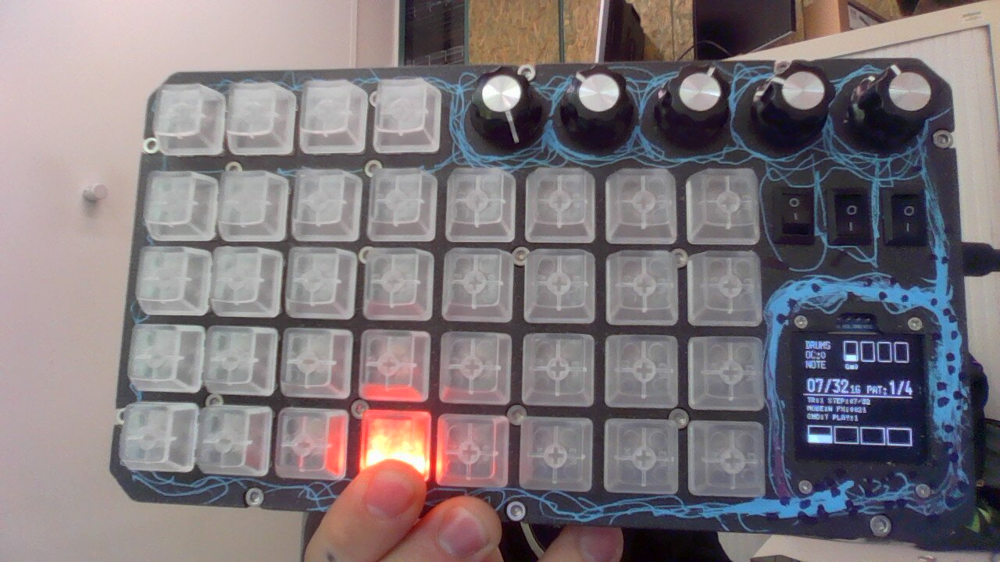

# MothOS — Groove Pad Box port

> **This project is a fork of [MothOS-original](../MothOS-original)**, the official Arduino firmware for [MothSynth](https://mothsynth.com/).  
> The goal is to adapt MothOS to a different hardware platform: the **Groove Pad Box**, a custom-built synthesizer where every key is **individually backlit** via a NeoPixel strip, equipped with a **128×128 px OLED display** (vs. 128×64 on the original), and where several audio effects are directly accessible through **physical potentiometers**.

---

## Hardware differences vs. MothOS-original

| Feature | MothOS-original | This fork |
|---|---|---|
| Keys | Matrix keypad (4 shared LED indicators) | 32 individual NeoPixel keys (3 LEDs/key, serpentine strip) |
| Display | SSD1306 128×64 | SH1107 128×128 |
| Effects on pots | — | Reverb, Delay, Phaser (per selected track) + master volume |

---

## Modified files vs. MothOS-original

### `HardwareConfig.h` *(added — does not exist in the original)*
Centralises all hardware configuration:
- I2S pins (`BCLK=18`, `WS=19`, `DOUT=5`)
- I2C bus pins for MCP23X17 key expanders
- OLED display pins (`SDA=26`, `SCL=27`)
- Potentiometer pins (`VOL=34`, `REVERB=35`, `DELAY=32`, `PHASER=2`)
- NeoPixel constants (4 rows × 8 columns, 3 LEDs/key)
- `#define USE_POTENTIOMETERS 1` (must stay a `#define`, not `constexpr`, for `#if` guards to work)

### `MothOS.ino`
- **Key scanning**: replaces the `Keypad` library with direct MCP23X17 reads over `buttonsWire` (I2C bus 1). `readMainButtonsMask()` returns a 32-bit bitmask.
- **8×4 keyboard layout**: the 32 keys are split into two groups of 4 columns (`ABCD ABCD`). The physical top row maps to the function keys (F1–F4). Logic: `effCol = col % 4`, `mapRow = (ROWS-1-row)`.
- **NeoPixel LEDs**: `getButtonLedIndexSerpentine()` — even rows go left-to-right, odd rows go right-to-left (serpentine wiring). Each pressed key lights its 3 LEDs with a unique colour (`trackColor` / `noteColor`).
- **I2S audio output**: `i2s.setPins(BCLK, WS, DOUT)` in STEREO 16-bit mode. Continuous generation timed with `micros()` (max 64 samples/loop).
- **Potentiometers**: `updatePotentiometers()` with exponential smoothing (`>> POT_ALPHA_SHIFT`), ADC inversion, and call to `tracker.ApplyPotControls()`.
- **OLED display**: `U8G2_SH1107_PIMORONI_128X128_F_HW_I2C` running on core 0 via `Task2Loop`.

### `Voice.h`
- `HISTORY_SIZE` reduced from `7700` to `4980` to fit in ESP32 DRAM (fixes a 21 624-byte linker overflow).

### `Voice.cpp`
- Extended constructor: explicit initialisation of all runtime fields (`mute`, `soloMute`, `overdrive`, `voiceNum`, `note`, `baseFreq`, `sampleHistoryIndex`, zeroed buffer) — prevents spurious sounds on boot.

### `Tracker.h` / `Tracker.cpp`
- New signature `ApplyPotControls(masterRaw, reverbRaw, delayRaw, phaserRaw)` — BPM potentiometer removed.
- `masterGainQ8` mapped 0–255 from the volume pot.
- Reverb, delay, phaser of the selected track mapped independently to 0–`POT_EFFECT_MAX` (=3).

### `ScreenManager.cpp`
- Extended to use full 128 px height: separator line at y=66, track/step/mode info rows, 4 VU-meter bars in the bottom 24 px.

---

## Build notes

- Select **Partition Scheme → Huge APP** in Arduino IDE.
- Required libraries: `U8g2`, `Adafruit MCP23X17`, `Adafruit NeoPixel`, `ESP_I2S`.
- `USE_POTENTIOMETERS` must be a `#define`, not a `constexpr`, for `#if` guards to work.

---

## ESP32-WROOM DRAM fit changes

To fix linker errors like:

- `.dram0.bss will not fit in region dram0_0_seg`
- `region dram0_0_seg overflowed`

the memory-heavy parts of the voice engine were reduced in RAM usage.

### Files changed

- `Voice.h`
- `Voice.cpp`

### What was changed

- Reduced the per-voice delay/reverb history buffer from `12001` samples (`int`) to `4980` samples (`int16_t`).
- Replaced several per-voice lookup tables from `int` to `int16_t`:
	- `noteFreqLookup[48]`
	- `whooshSin[101]`
	- `envelopes[4][101]`
- Replaced hardcoded history ring values (`24000`) with constants derived from the new buffer size:
	- `HISTORY_SIZE = 4980`
	- `HISTORY_STEPS = HISTORY_SIZE * 2`

### Why this fixes the issue

`Tracker` contains 4 `Voice` instances. The history buffer exists once per voice, so RAM scales by 4.

- Previous history RAM: `12001 * 4 bytes * 4 voices = 192,016 bytes`
- New history RAM: `4980 * 2 bytes * 4 voices = 39,840 bytes`

This saves about **152 KB** just on history buffers, which is enough to resolve the DRAM overflow on ESP32-WROOM builds.

### Runtime impact

- Audio behavior is preserved.
- Delay/reverb tails are slightly shorter because the history buffer is shorter.

---

## ESP32-WROOM boot-loop fixes

If the board reboots continuously at startup, the most common reason is using reserved/unsafe GPIOs on ESP32-WROOM (especially GPIO 6..11, used by flash) or running a display task without yielding.

### File changed

- `MothOS.ino`

### What was changed

- **LED manager pins** moved away from flash-bus pins:
	- From `LedManager(9, 10, 11, 12)`
	- To `LedManager(23, 13, 14, 25)`
- **I2S pins** updated to safe ESP32-WROOM mapping:
	- From `i2s.setPins(6, 7, 5)`
	- To `i2s.setPins(18, 19, 5)`
- **Sample rate** reduced for stability and CPU headroom:
	- From `44100`
	- To `16384`
- **OLED pins** set to the hardware wiring:
	- Display constructor uses `clock=27`, `data=26`
	- `Wire.begin(26, 27, 400000)` added before `screen.begin()`
- **OLED task startup order** fixed:
	- Task is created **after** `screen.begin()` so it cannot draw on an uninitialised display.
- **OLED task watchdog protection**:
	- `delay(20)` added in `Task2Loop` to yield CPU and avoid WDT resets.

### Why this fixes resets

- GPIO 6..11 are connected to the SPI flash on ESP32-WROOM; driving them for LEDs/I2S can crash or reboot the MCU.
- A tight infinite display loop with no yield can trigger the task watchdog.
- Starting the display task before `screen.begin()` can cause undefined behavior.

---

# Important Notes:
* ESP32 S3 with 512kb RAM and 4MB Flash Required if building DIY MothSynths
* When compiling sketch, select PARTITION SCHEME / HUGE APP from Arduino IDE tools menu, otherwise the app wont fit on your esp32

# MothSynth
MothSynth is an opensource, ultracheap music making platform based on a few components DIY enthusiasts might find in their drawers. Available in pre-assembled, PCB schematic and DIY module forms. Scroll down for GitHub and Schematics.

There are a few ways to get your hands dirty with MothSynth, build one yourself from modules easily obtainable from Amazon or AliExpress, manufacture your own PCB, or purchase one from our store.

MothOS, the default Arduino compatible software, currently supports 4 tracks, 2 drum machine banks, 10 instrumets and 5 effects (delay, lowpass, phaser, reverb and overdrive), but who knows where developers will take it! Check out our GitHub and Schematics below!

To upload your own samples to MothSynth, clone the GitHub repo, convert your samples with sample converter and replace .h files in /Samples directory of MothOS Arduino Project.

Sample Converter, pre-assembled boards, schematics and usage info: (https://mothsynth.com/).

# DIY Instructions:
If you're building your own MothSynth, You'll need the following commontly available modules, you'll just need to modify pin assignments in the MothOS project:
- ESP32S3 Dev Board
- Max98357 Breakout Board
- Arduino Compatible Keypad
- 4 LEDs + Required Resistors

# PCB Schematic

